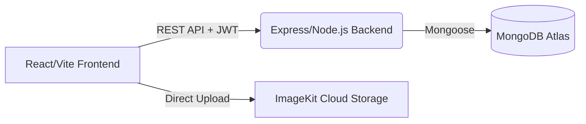

# 🎓 GraVITal
> **The Ultimate Academic Tracking & Simulation Platform for VIT Students.**

[](https://reactjs.org/)
[](https://nodejs.org/)
[](https://www.mongodb.com/)
[](https://opensource.org/licenses/MIT)

> **Smart Academic Analytics & CGPA Optimization Platform**

GraVITal is a full-stack, SaaS-style web application designed to help students track, analyze, and optimize their academic performance. Built with a modern tech stack, it features secure JWT authentication, dynamic CGPA forecasting, and cloud-based profile management.

---

## ✨ Core Features

- **🔐 Secure Authentication:** Full JWT-based login/signup system with encrypted password storage.
- **📊 Advanced GPA Calculators:** Calculate semester GPA and overall CGPA with ease.
- **🎯 Target CGPA Planner:** Reverse-engineer the grades you need to hit your dream CGPA.
- **📈 ScoreFlow Analytics:** Seamless processing and visualization of VTOP academic data.
- **☁️ Cloud Profile Management:** Upload and manage profile photos instantly using ImageKit.
- **⚡ Performance Optimized:** Intelligent `localStorage` caching ensures lightning-fast data retrieval.
- **🛡️ Protected API Routes:** Complete backend middleware security ensuring data privacy.
- **👀 Guest Mode:** Try the application locally without creating an account.

---

## 🧠 System Architecture

GraVITal utilizes a decoupled client-server architecture, allowing the frontend and backend to scale independently.



- **Frontend:** Built with React and Vite for a highly responsive, single-page application experience. Context API manages global state (Authentication, GPA Data).
- **Backend:** A robust Node.js and Express server handling business logic, token issuance, and data validation.
- **Database:** MongoDB stores user credentials, profile metadata, and persistent ScoreFlow analytics.

---

## 🔒 Security Features

Security is a first-class citizen in GraVITal:
- **JWT Authentication:** Stateless, secure token-based auth flow (`expiresIn: 7d`).
- **Password Hashing:** `bcryptjs` is used to salt and hash passwords before they ever touch the database.
- **Helmet Middleware:** Protects against Cross-Site Scripting (XSS), Clickjacking, and packet sniffing by setting secure HTTP headers.
- **Rate Limiting:** `express-rate-limit` prevents brute-force login attempts and DDoS attacks.
- **CORS Restrictions:** Cross-Origin Resource Sharing is strictly locked to the production frontend URL.
- **Route Protection:** Custom backend middleware validates the `Authorization: Bearer <token>` header before granting access to sensitive routes.

---

## ⚙️ Tech Stack

**Frontend:** React 19, Vite, TailwindCSS, Framer Motion, React Router DOM  
**Backend:** Node.js, Express.js, JSONWebToken (JWT), bcryptjs, Helmet  
**Database:** MongoDB Atlas, Mongoose ODM  
**Cloud Services:** ImageKit.io (Image Hosting)  

---

## 🚀 Getting Started

Follow these instructions to set up the project locally for development.

### 1. Clone the repository
```bash
git clone https://github.com/yourusername/GraVITal.git
cd GraVITal
```

### 2. Install Dependencies
This project uses a root `package.json` to manage both environments concurrently.
```bash
npm install
```

### 3. Setup Environment Variables
You will need two `.env` files. 

**Backend (`backend/.env`):**
```env
PORT=5000
MONGODB_URI=your_mongodb_connection_string
JWT_SECRET=your_super_secret_jwt_string
FRONTEND_URL=http://localhost:5173

# ImageKit Configuration
IMAGEKIT_PUBLIC_KEY=your_public_key
IMAGEKIT_PRIVATE_KEY=your_private_key
IMAGEKIT_URL_ENDPOINT=your_url_endpoint
```

**Frontend (`.env` in root):**
```env
VITE_API_URL=http://localhost:5000
```

### 4. Run the Application
Start both the Vite frontend and the Express backend concurrently:
```bash
npm run dev
```
- Frontend: `http://localhost:5173`
- Backend: `http://localhost:5000`

---

## 📦 Deployment Guide

GraVITal is designed to be easily deployed to modern cloud hosting platforms.

### Frontend (Vercel)
1. Push your repository to GitHub.
2. Import the project into Vercel.
3. Vercel will automatically detect Vite. 
4. Add the `VITE_API_URL` environment variable pointing to your deployed backend (e.g., `https://gravital-api.onrender.com`).
5. Deploy.

### Backend (Render)
1. Create a new Web Service on Render connected to your repository.
2. Set the Build Command to `npm install` and Start Command to `node backend/server.js`.
3. Add all backend environment variables (`MONGODB_URI`, `JWT_SECRET`, `IMAGEKIT_*`).
4. Set `FRONTEND_URL` to your Vercel deployment URL (e.g., `https://gravital.vercel.app`).
5. Deploy.

---

## 📸 Screenshots

| Dashboard Analytics | GPA Calculator |
|:---:|:---:|
| *(Add dashboard screenshot here)* | *(Add calculator screenshot here)* |

| ScoreFlow Interface | User Profile |
|:---:|:---:|
| *(Add scoreflow screenshot here)* | *(Add profile screenshot here)* |

---

## 📈 Future Improvements

- **HTTP-Only Cookies:** Migrate JWT storage from `localStorage` to secure HTTP-only cookies to eliminate XSS vulnerabilities.
- **Refresh Tokens:** Implement a short-lived Access Token / long-lived Refresh Token architecture.
- **Advanced Analytics:** Implement charting libraries to visualize GPA trends over multiple semesters.
- **Mobile App:** Package the application using React Native or Capacitor for native iOS/Android experiences.

---

## 🧠 Author's Note

Building GraVITal was a profound journey into full-stack engineering and production-grade system design. Rather than just making things work, the focus was heavily placed on **how** they work under pressure. 

From wrestling with asynchronous React state batching and race conditions during authentication flows, to debugging ES Module environment variable hoisting (`dotenv` timing issues), to optimizing React Context re-renders using `useMemo` and `useCallback`—every feature was built with a scale-first mindset. 

This project bridges the gap between academic theory and real-world SaaS architecture, serving as a testament to the fact that robust error handling, secure middleware, and clean API design are just as important as the UI itself.
